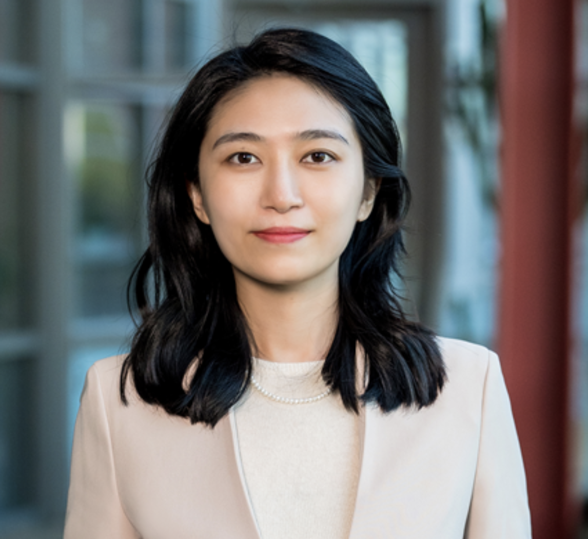
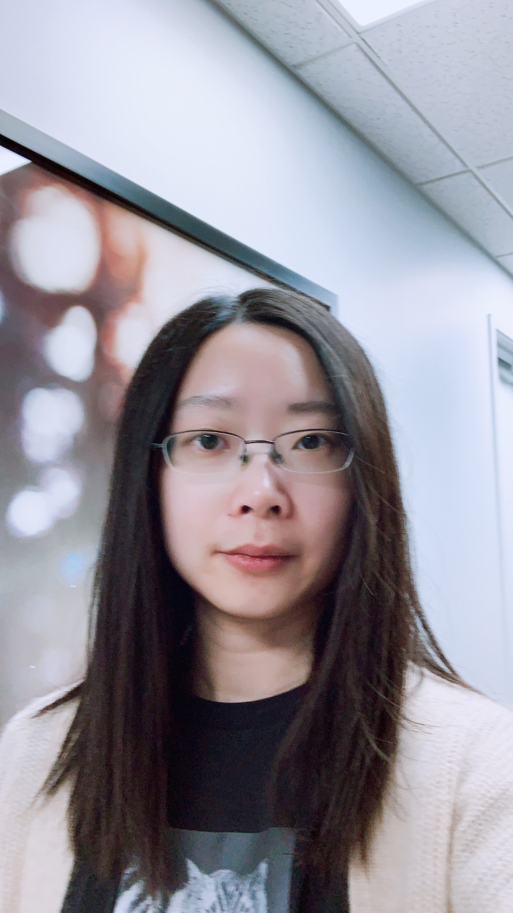
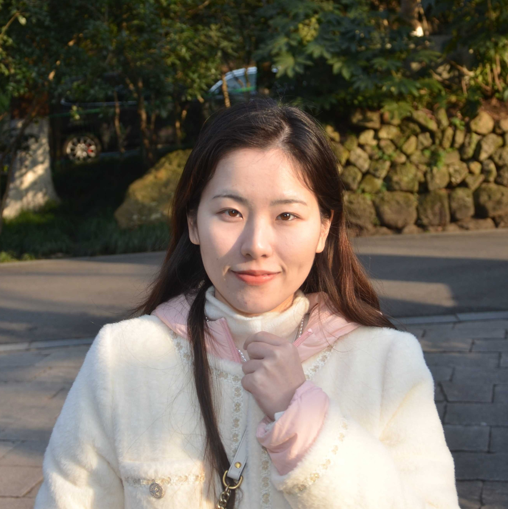
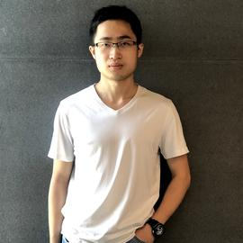
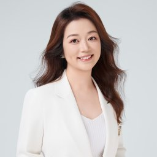

Welcome to the official page for our AAAI 2025 tutorial!

## Overview

- **Speakers:** [Manling Li](https://limanling.github.io/), [Zoey Sha Li](https://raspberryice.github.io/), [Yuji Zhang](https://celestinezyj.github.io/), [Chi Han](https://glaciohound.github.io), [Heng Ji](https://blender.cs.illinois.edu/hengji.html) 
- **Venue:** [AAAI 2025 Tutorials](https://aaai.org/conference/aaai/aaai-25/tutorial-and-lab-list/#TQ17)
- **Date and Time:** Wednesday, February 26, 8:30pm-12:30pm, 2025
- **Location:** [Pennsylvania Convention Center](https://www.paconvention.com), Room 113A, Philadelphia, PA USA

## Title: The Lifecycle of Knowledge in Large Language Models: Memorization, Editing, and Beyond

Knowledge is an important prerequisite for various AI applications. It is typically sourced from either structured knowledge sources, such as knowledge bases and dictionaries, or unstructured knowledge sources, such as Wikipedia documents. More recently, researchers have discovered that large language models (FMs) already possess a significant amount of knowledge through pre-training.

Inspired by this, large language models have been used to generate commonsense knowledge and factual knowledge context for question answering. While the results are encouraging, there are still lingering questions: Where does this knowledge come from? How much knowledge do large language models know? Is this knowledge reliable? If some knowledge is wrong, how can we fix it? Our tutorial examines the lifecycle of knowledge within large language models: (1) the emergence of knowledge through foundation model pre-training; (2) injection of external knowledge; (3) the updating and modification of knowledge; (4) probing and generation of knowledge; (5) integration of multimodal knowledge, including physical world understanding and procedural planning. Our target audience are from NLP/AI/ML communities. Audience will learn of a comprehensive review of recent advances and also an in-depth analysis of future directions on the interaction between knowledge and LLMs. Currently, researchers that focus on different stages in this lifecycle are scattered across different sub-communities within machine learning: probing and editing knowledge are often associated with the interpretability track, injecting knowledge is often application-specific and is discussed within the dialog, QA, IE, or summarization tasks, and multi-modal knowledge such as physical world knowledge and procedural planning knowledge is often deliberated by vision and robotics communities. Our tutorial seeks to bring these researchers together and facilitate collaboration to create a more holistic view of the problem.

## Speakers

### Manling Li

Manling Li is an Assistant Professor at Northwestern University. She was a postdoc at Stanford University and obtained the PhD degree in Computer Science at University of Illinois Urbana-Champaign in 2023. She works on the intersection of language, vision, and robotics. Her work won the ACL’24 Outstanding Paper Award, ACL'20 Best Demo Paper Award, and NAACL'21 Best Demo Paper Award. She was a recipient of Microsoft Research PhD Fellowship in 2021, an EE CS Rising Star in 2022, a DARPA Riser in 2022, etc. She served as Organizing Committee of ACL 25, NAACL 25, EMNLP 24, and delivered tutorials about multimodal knowledge at IJCAI'24, CVPR'23, NAACL'22, AAAI'21, ACL'21, etc. 

### Zoey Li 

(Zoey) Sha Li is an applied scientist at Amazon working on LLM pretraining scaling laws and data selection. She obtained her PhD in 2024 at the University of Illinois Urbana-Champaign working with Prof. Jiawei Han and Prof. Heng Ji. Her past research was mainly on information extraction and procedure understanding, extending to the understanding of knowledge within language models and utilizing LMs for knowledge-intensive tasks. She has published 20+ papers at venues such as ACL, EMNLP, NAACL, Neurips, WWW and is an organizer of the workshop "Towards Knowledgeable Language Models" at ACL 2024.

### Yuji Zhang

Yuji Zhang is a postdoctoral researcher in computer science at the University of Illinois, Urbana-Champaign, advised by Prof. Heng Ji. She works on interpreting and updating large language models (LLM), with a focus on knowledge mechanisms in LLMs. She has papers in top-tier conferences including EMNLP, ACL, ICLR, etc. 

### Chi Han

Chi Han is a Ph.D. candidate in computer science at UIUC, advised by Prof. Heng Ji. His research focuses on understanding and adapting large language model (LLM) representations. He has first-authored papers in NeurIPS, ICLR, NAACL, and ACL, earning Outstanding Paper Awards at NAACL 2024 and ACL 2024.

### Heng Ji

Heng Ji, a Professor at UIUC and Amazon Scholar, directs the Amazon-Illinois Center on AI for Interactive Conversational Experiences. With expertise in NLP, multimedia multilingual information extraction, and knowledge-enhanced language models, she has earned numerous accolades, including IEEE’s “AI’s 10 to Watch,” NSF CAREER, and multiple Best Paper Awards.

## Time Schedule

| Time           | Topic | Presenter |
|---------------|-------------------------------------------|------------|
| **8:30 - 10:30 AM** | **Session 1: Foundations of Knowledge** | |
| 8:30 - 8:45 AM  | Motivation and Overview | Heng Ji |
| 8:45 - 9:20 AM  | Knowledge Acquisition and Memorization | Zoey Sha Li |
| 9:20 - 9:45 AM  | Knowledge Storage | Chi Han |
| 9:45 - 10:10 AM | Knowledge Boundary | Yuji Zhang |
| 10:10 - 10:30 AM | Knowledge Editing | Yuji Zhang |
| **10:30 - 11:00 AM** | ☕ **Coffee Break** | ------ |
| **11:00 - 12:30 PM** | **Session 2: Advanced Topics in Knowledge** | |
| 11:00 - 11:25 AM | Knowledge Unlearning | Manling Li |
| 11:25 - 11:50 AM | Potential Direction 1: Knowledge Updating (Beyond Triplet Form Knowledge) | Zoey Sha Li |
| 11:50 - 12:15 PM | Potential Direction 2: Reasoning | Yuji Zhang |
| 12:15 - 12:30 PM | Conclusion & Q&A | ALL Speakers |

## Materials

To be updated.
